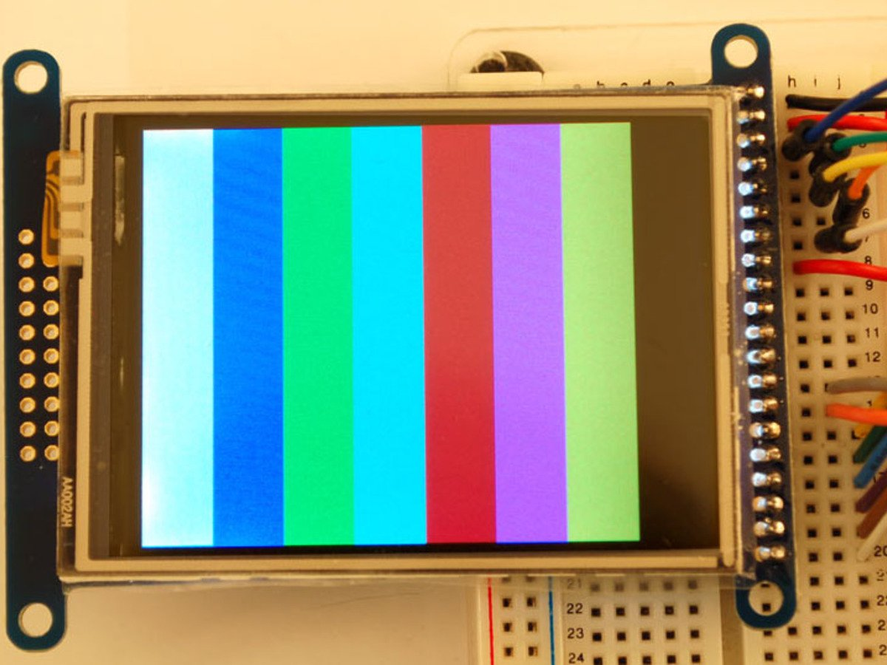

# Adafruit library for 8-bit TFT LCDs such as ILI9325, ILI9328, etc 

This is a library for our Adafruit 16-channel PWM & Servo driver, shield or FeatherWing

Pick one up today in the adafruit shop!
  * https://www.adafruit.com/product/335
  * https://www.adafruit.com/product/376

These displays use 8-bit parallel to communicate, 12 or 13 pins are required to interface (RST is optional).

Adafruit invests time and resources providing this open source code, please support Adafruit and open-source hardware by purchasing products from Adafruit!

Written by Limor Fried/Ladyada for Adafruit Industries. BSD license, check license.txt for more information. 

All text above must be included in any redistribution

To install, use the Arduino Library Manager and search for "Adafruit 2.8" TFT display Library" and install the library.
