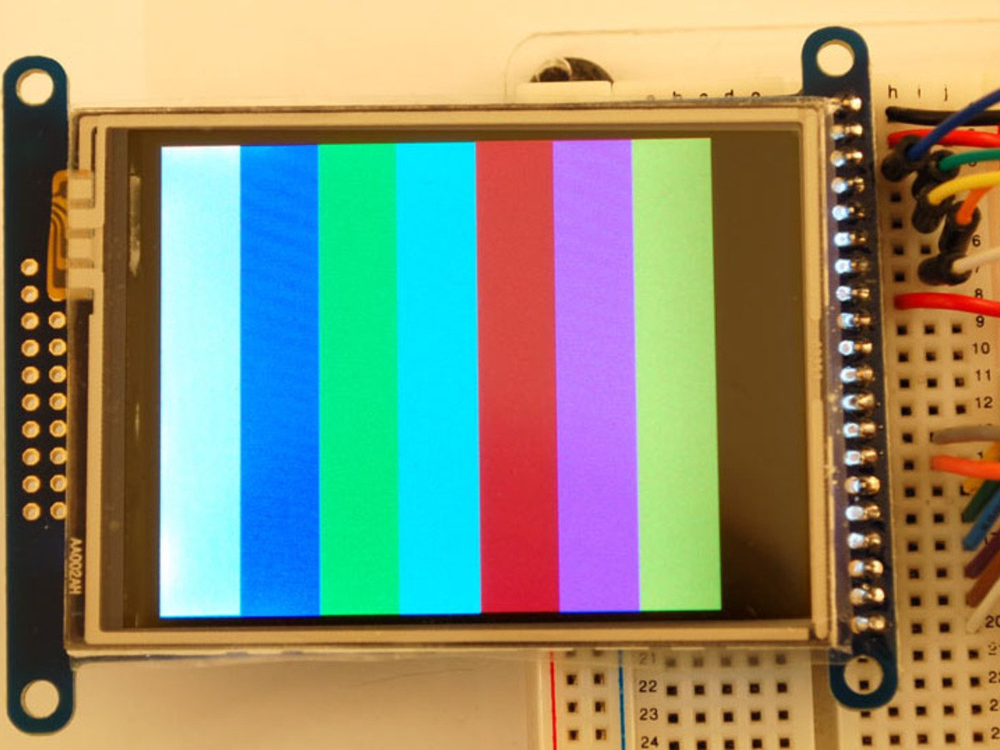

# Adafruit library for 8-bit TFT LCDs such as ILI9325, ILI9328, etc

This is a library for our Adafruit 8-bit TFT LCD breakouts

Pick one up today in the adafruit shop!
  * [https://www.adafruit.com/product/335](https://www.adafruit.com/product/1770)
  * https://www.adafruit.com/product/376
  * https://www.adafruit.com/product/335

These displays use 8-bit parallel to communicate, 12 or 13 pins are required to interface (RST is optional). This library supports 8-bit and 16-bit parallel TFT displays on AVR (ATmega328/32u4/1280/2560) and the Arduino Due (SAM3X8E) only. It does not support ESP32, ESP8266, SAMD or RP2040 boards. For parallel displays on ESP32-S3, see the LCD_CAM peripheral and a library that drives it.

Adafruit invests time and resources providing this open source code, please support Adafruit and open-source hardware by purchasing products from Adafruit!

Written by Limor Fried/Ladyada for Adafruit Industries. BSD license, check license.txt for more information. 

All text above must be included in any redistribution

To install, use the Arduino Library Manager and search for "Adafruit 2.8" TFT display Library" and install the library.
